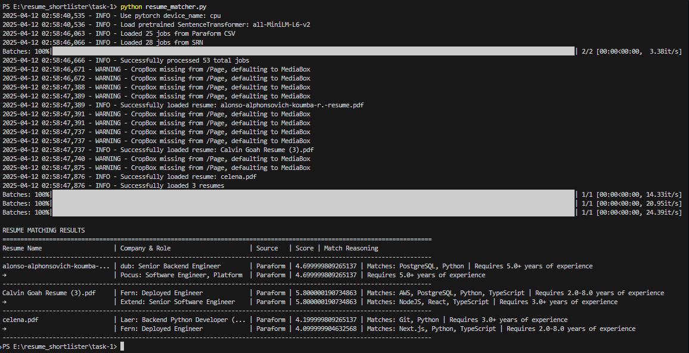
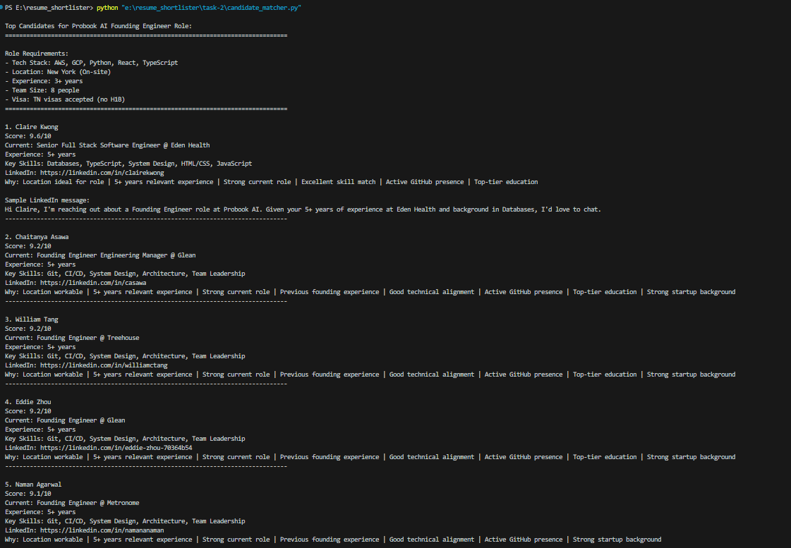

# Resume Shortlister Project

This project consists of two tasks that demonstrate different approaches to matching and analyzing resumes and job candidates.

## Overview

### Task 1: Resume Matcher
Located in `/task-1`, this system matches resumes against job postings from multiple sources (Paraform and SRN) using advanced NLP techniques.



**Key Features:**
- Multi-source job data integration (Paraform CSV and SRN)
- PDF resume processing
- BERT-based text similarity scoring
- Technical stack matching
- Experience level validation

[Go to Task 1 Details](./task-1/README.md)

### Task 2: Candidate Matcher
Located in `/task-2`, this system processes candidate data from a CSV file and matches them based on various criteria.



**Key Features:**
- CSV data processing
- Skill-based matching
- Experience-based filtering
- Match score calculation
- Detailed candidate insights

[Go to Task 2 Details](./task-2/README.md)

## Getting Started

### Prerequisites
- Python 3.8 or higher
- Required packages for each task (see individual README files)

### Setup and Running

#### Task 1: Resume Matcher
1. Navigate to the task-1 directory:
   ```
   cd task-1
   ```
2. Install dependencies:
   ```
   pip install -r requirements.txt
   ```
3. Place PDF resumes in the `resumes` directory
4. Run the matcher:
   ```
   python resume_matcher.py
   ```

#### Task 2: Candidate Matcher
1. Navigate to the task-2 directory:
   ```
   cd task-2
   ```
2. Install required packages:
   ```
   pip install pandas numpy
   ```
3. Run the matcher:
   ```
   python candidate_matcher.py
   ```

## Project Structure
```
resume_shortlister/
├── task-1/                    # Resume Matcher
│   ├── resume_matcher.py      # Main matching script
│   ├── srn_scraper.py        # Job scraper
│   ├── Paraform_Jobs - S1.csv # Job data
│   └── resumes/              # PDF resumes
│
└── task-2/                    # Candidate Matcher
    ├── candidate_matcher.py   # Main matching script
    └── JuiceboxExport.csv    # Candidate data

```

## Results
Both tasks include screenshots of their results in their respective directories, demonstrating the matching capabilities and output format of each system.

For detailed information about each task's implementation, scoring methodology, and specific features, please refer to their individual README files in their respective directories.