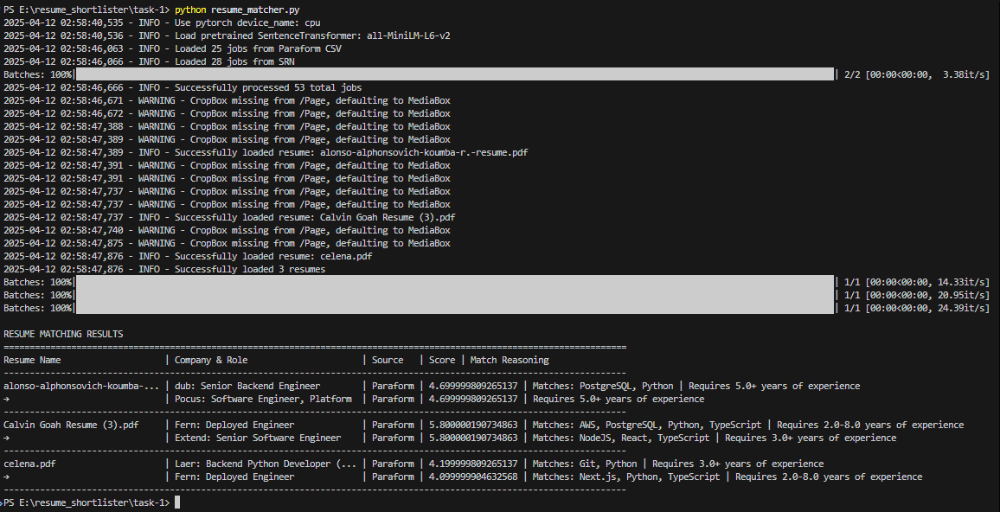

# Resume Matcher

This project is a sophisticated resume matching system that analyzes resumes against job postings from multiple sources (Paraform and SRN) to find the best matches based on various criteria.

## Project Structure

```
task-1/
├── resume_matcher.py       # Main script for matching resumes with jobs
├── srn_scraper.py         # Scraper for SRN job listings
├── requirements.txt       # Python dependencies
├── Paraform_Jobs - S1.csv # Job listings from Paraform
├── srn_jobs.json         # Scraped job listings from SRN
└── resumes/              # Directory containing PDF resumes
    └── *.pdf            # PDF resume files
```

## How It Works

### 1. Job Data Collection
- Loads job postings from two sources:
  - Paraform CSV file
  - SRN JSON data (scraped job listings)

### 2. Resume Processing
- Reads PDF resumes from the `resumes` directory
- Extracts text content using `pdfplumber`
- Processes the text for matching

### 3. Matching Algorithm
The matching process uses several criteria to score job fits:

#### Score Calculation (1-10 scale)
1. **Text Similarity (Base Score)**
   - Uses BERT-based embeddings (SentenceTransformer)
   - Converts cosine similarity to 1-10 scale
   - Weights: 60% of final score

2. **Technical Stack Match**
   - Matches resume skills against job requirements
   - Boosts score based on matching technologies
   - Weights: 25% of final score

3. **Experience Match**
   - Compares years of experience
   - Validates against job requirements
   - Weights: 15% of final score

### 4. Output Format
For each resume, shows:
- Resume name
- Top 2 matching jobs with:
  - Company and role
  - Source (Paraform/SRN)
  - Match score (1-10)
  - Technical matches
  - Experience requirement match

## Results Screenshot



## Requirements

```
sentence-transformers
pdfplumber
pandas
numpy
scikit-learn
```

## How to Use

1. Place PDF resumes in the `resumes` directory
2. Run the script:
   ```
   python resume_matcher.py
   ```
3. Review matches in the output table

## Score Interpretation

- 8-10: Excellent match
- 6-7.9: Good match
- 4-5.9: Moderate match
- <4: Poor match

The scoring system considers:
- Technical skill overlap
- Experience level match
- Job description similarity
- Industry alignment